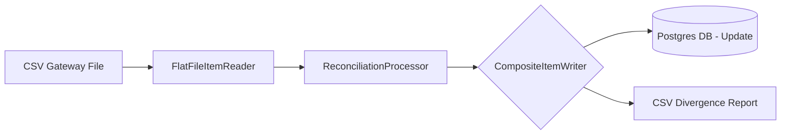

# Financial Transaction Reconciliation System

This project is a financial transaction reconciliation system built with **Spring Batch 6.0 (Spring Boot 3.4+)**. It demonstrates a robust solution to a classic fintech/e-commerce problem: validating whether records from an external payment gateway match the internal database orders, identifying discrepancies in amounts, statuses, or missing records.

### Why this project?

Batch processing is the right tool for this scenario instead of synchronous REST calls, because it provides:
- **High Performance:** Processes thousands of records in "chunks", optimizing memory usage and database transactions.
- **Fault Tolerance:** Configured to skip parsing errors or invalid data in individual records without stopping the entire process.
- **Scalability:** Able to handle large volumes of data (the sample database starts with 47,000+ records).
- **Multi-Destination Writing:** Uses a `CompositeItemWriter` to update the database and generate a divergence report simultaneously.

---

### System Architecture

The processing flow follows the ItemReader -> ItemProcessor -> ItemWriter pattern:



---

### Tech Stack

- **Java 17**
- **Spring Boot 3.4.1**
- **Spring Batch 6.0** (using modern APIs such as `ChunkOrientedStepBuilder`)
- **Spring Data JPA**
- **PostgreSQL 15**
- **Docker & Docker Compose**
- **Lombok**
- **JUnit 5 & Mockito**

---

### Setup and Execution

#### Prerequisites
- Docker and Docker Compose installed.
- Java 17+ installed (for local execution).

#### 1. Start the Infrastructure (Database)
Docker Compose starts Postgres and runs the `init.sql` script, which populates the database with ~47,000 test records.
```bash
docker-compose up -d
```

#### 2. Run the Application
Since this is a command-line job, it will start automatically when running the jar or via Maven:
```bash
./mvnw spring-boot:run
```

---

### Reconciliation Logic

The `ReconciliationItemProcessor` compares the CSV (gateway) data against the internal database following these rules:

| Result | Description |
| :--- | :--- |
| **RECONCILED** | Amount (0.01 tolerance) and status match. |
| **AMOUNT_MISMATCH** | Status matches, but the amount differs beyond the tolerance. |
| **STATUS_MISMATCH** | Amount matches, but the status is incorrect. |
| **AMOUNT_AND_STATUS_MISMATCH** | Both amount and status diverge. |
| **NOT_FOUND** | Transaction present in the CSV but not found in the database. |

---

### Example Input and Output

**Input (transactions.csv):**
```csv
transactionId,transactionDate,amount,gatewayStatus
TRX-007963,2026-09-11,668.79,APPROVED
TRX-044436,2026-09-01,1355.88,DECLINED
```

**Output (divergence-report.csv):**
```csv
transactionId,databaseAmount,gatewayAmount,databaseStatus,gatewayStatus,result,observation,processingDate
TRX-044436,1355.88,1355.88,PENDING,DECLINED,STATUS_MISMATCH,Status mismatch between database and gateway,2026-09-20T21:16...
```

---

### Fault Tolerance & Performance

- **Chunk Size (500):** The job processes 500 records per transaction, balancing speed and memory usage.
- **Skip Policy:** The job skips up to **100 errors** from parsing (`FlatFileParseException`), numeric format issues, or invalid business data.
- **Transactional Writing:** The database update and the divergence report write happen within the same transactional window as the chunk.

---

### Tests

To run the unit test suite:
```bash
./mvnw test
```
The tests cover the processor logic, field mapping, and the custom writers.

---

### Useful SQL Queries

After a run, you can validate the results in the database:
```sql
-- Count by reconciliation status
SELECT reconciliation_status, COUNT(*) 
FROM tb_order 
GROUP BY reconciliation_status;

-- View transactions with amount mismatches
SELECT * FROM tb_order WHERE reconciliation_status = 'AMOUNT_MISMATCH';
```

---

### Limitations and Future Improvements

- **Per-Item Lookup:** The processor currently looks up each transaction individually in the database. For massive volumes, a bulk-reading or caching strategy would be more efficient.
- **Data Migration:** Use Flyway or Liquibase to manage the schema instead of manual `init.sql` scripts.

---
*This is a portfolio project for technical demonstration of Spring Batch.*